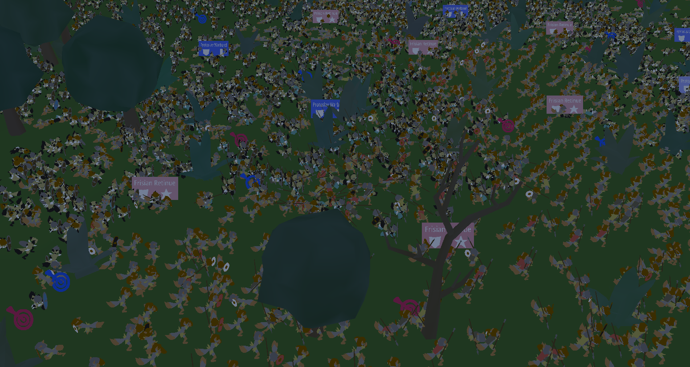

# kontostwo.github.io
## Battle Critters
The tech blog of an RTS game that allows you to design and fight battles where you command up to 500,000 critters. [Link to the landing page](https://superstrategyhorse.carrd.co/)

 - [Multithreading](battlecritters/multithreading.md)
 - Frustrum Culling
 - GPU vertex animations
 - ECS memory layout
 - Pixel Fill Rate
 - SIMD data types and operations
 - Branchless Programming
 - Formation Smart Rebalancing
 - Unit Destination Visualizer
